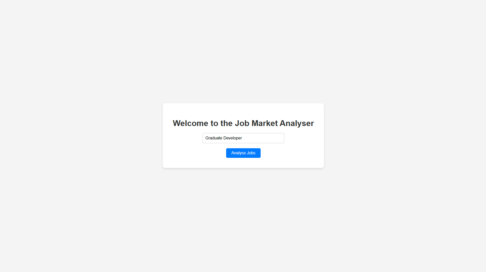
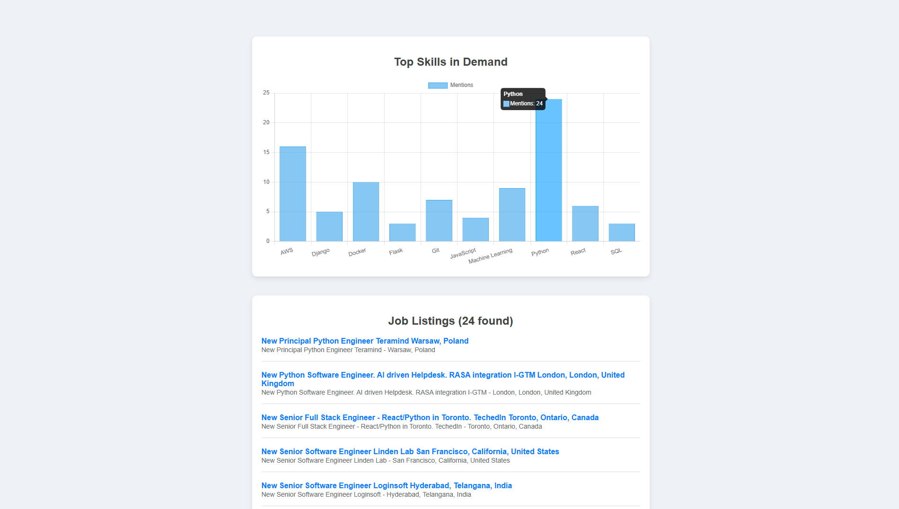

# Job Market Analyzer

A web application that scrapes real job listings, analyses in-demand skills using NLP, and displays job openings with direct links - perfect for job seekers to see most relevant skills employers want.

## Features

- **Search** for any job role or keyword (e.g. "Python Developer")
- **Web scraper** pulls job listings from [python.org/jobs](https://www.python.org/jobs/)
- **NLP-based skill extraction** from job descriptions
- **Interactive chart** showing top skills using Chart.js
- **Job listing results** with titles, companies, locations, and clickable links
- Clean and modern UI using HTML, CSS, and Flask templating

## Tech Stack

- **Backend:** Python, Flask
- **Scraping:** Requests, BeautifulSoup
- **Data Processing:** pandas, re, collections
- **Visualization:** Chart.js (bar chart)
- **Frontend:** HTML5, CSS3, Jinja2 (Flask templates)

---

## Screenshots

### Home Page

### Results Page with Skills Chart & Job Listings

---

## Example Output

You search for **machine learning**

- The app scrapes jobs from the web
- Extracts relevant skills like **Python**, **TensorFlow**, **PyTorch**
- Displays a chart of in-demand skills
- Lists job titles with direct links, such as:

  - **Machine Learning Engineer** — *OpenAI* — Remote  
  - **Data Scientist** — *Google* — London  

---

## To Do

- [ ] Add support for multiple job boards  
- [ ] Highlight matched keywords in job descriptions  
- [ ] Add pagination or infinite scroll  
